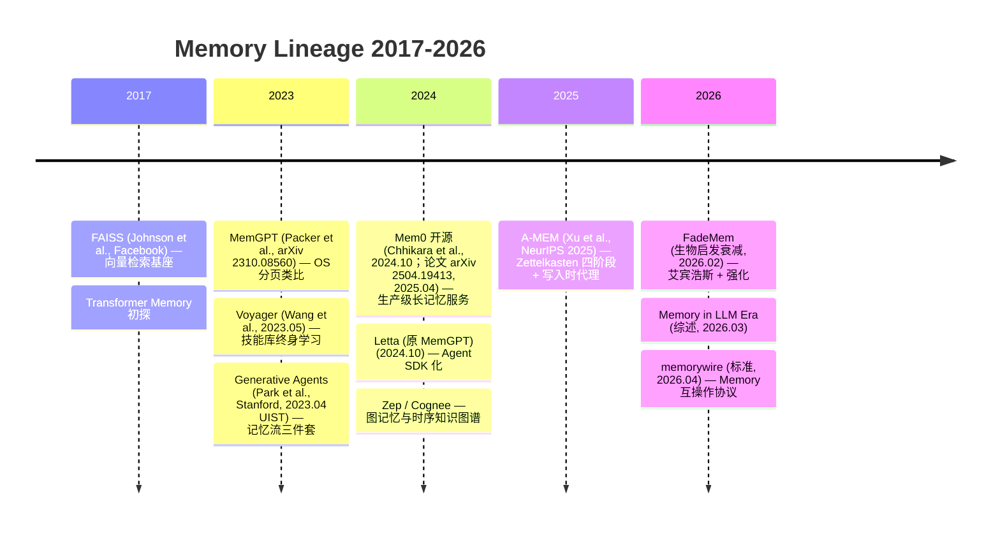

# 第6章 Memory 深潜：从 MemGPT 到 A-MEM

> Context 是“工作记忆”，Memory 是“长期记忆”。如果 Context 解决“这一轮别爆窗”，Memory 就解决“下一轮还记得、跨会话仍连贯、越用越懂你”。本章把九家实现放回到 2017—2026 的论文与系统 lineage 中，拆开“五维分类 × 四范式 × Memory Pipeline 五步”，并给出最小 Zettelkasten 的可运行 Lab。

## 本章图谱

```
论文 lineage ──► 原理抽象 ──► 七家对证 ──► 权衡取舍 ──► 未来演进
 MemGPT          五维分类      Grok/DeepSeek  Pipeline 五步  Federated
 Voyager         四范式        OpenCode/Claude OS分页 vs  多模态
 GenAgents       写入/检索     Pi/Codex/Claw  Zettelkasten vs Safety
 Mem0/Letta      代理权        RAG 边界       衰减曲线     端侧小模型
 A-MEM/FadeMem
 FAISS/Zep
```

---

## 6.1 历史脉络：从 OS 分页到生物衰减的 Lineage

### 6.1.1 时间轴全景（2017—2026）



### 6.1.2 论文与系统对照表

| 年份 | 工作 | 核心贡献 | 一句话定位 | 对本书各家的影子 |
|------|------|----------|------------|------------------|
| **2017** | **FAISS** — Johnson et al., Facebook AI Research | IVF/PQ/ HNSW 向量索引，十亿级近邻检索 | 向量存储的“操作系统” | 所有向量检索的底座；Zep、Mem0 均默认 FAISS/Chroma 混合 |
| **2023.04** | **Generative Agents** — Park et al., Stanford / Google, UIST 2023 | 记忆流（Memory Stream）+ 重要性评分 + 反思（Reflection） | 首次把“检索-反思-规划”闭环做完整的小镇模拟 | Claude `compactConversation()` 的五要素摘要即弱化版 Reflection |
| **2023.05** | **Voyager** — Wang et al., NVIDIA, arXiv 2305.16291 | 自动课程（Automatic Curriculum）+ 技能库（Skill Library）+ 迭代提示 | Minecraft 中的终身学习 Agent | OpenCode `skill/` + Grok `SkillInfo` 的思想源头；Codex `ToolExposure.Deferred` 的“技能按需加载” |
| **2023.10** | **MemGPT** — Packer et al., UC Berkeley, **arXiv 2310.08560** | **OS 分页类比**：主上下文（Main Context）≈ RAM，外部上下文（External Context）≈ Disk，中断/函数调用 ≈ Page Fault | 把 Memory 调度问题转化为 OS 内存管理问题 | **直接影响**：Claude 四层防线、Grok `CompactionPolicy`、Codex `compact.rs` 的逐级驱逐 |
| **2024.10 开源 / 论文 2025.04** | **Mem0** — Chhikara et al., arXiv 2504.19413 | 抽取-更新-检索三阶段（含 ADD/UPDATE/DELETE/NOOP 决策），`add/search/get` API，生产级去重与冲突解决 | 把 Memory 做成可商用的“托管记忆服务” | DeepSeek `session-projection-cache` 与 Grok `xai-grok-memory` 的产品形态对位 |
| **2024.10** | **Letta** — Letta (原 MemGPT 团队) | 将 MemGPT 框架产品化为 Letta Agent SDK，支持多 Agent 状态机与记忆块（Memory Blocks） | MemGPT 的工程化分叉 | Codex `core/src/state/` + OpenCode `SessionTable` 的块化存储可视为同构 |
| **2025.10** | **A-MEM** — Xu et al., **NeurIPS 2025** (arXiv 2502.12110) | **Zettelkasten 笔记盒** + **Note / Link / Evolution / Retrieval 四阶段** + **写入时（Write-time）代理权** | Memory 的“代理权前移”里程碑 | **本章核心对证**：与 RAG 的检索时代理形成镜像对比（见 6.2.3） |
| **2026.02** | **FadeMem** — (生物启发衰减, 2026) | 艾宾浩斯遗忘曲线 + 强化回放 + 重要性门控的动态衰减，支持“自然遗忘” | Memory 的“遗忘”有了可微公式 | Grok `memory_flush` 与 DeepSeek `compaction-tool-result-pruner` 的遗忘策略的理论底座 |
| **2026.03** | **Memory in the LLM Era** — 综述 (2026) | 系统化五维分类（时间×类型×组织×代理权×演化）与四范式框架 | 本章 6.2 的分类学直接来源 | 全书 Memory 术语的收敛锚点 |
| **2026.04** | **memorywire** — 标准 (2026) | 定义 Memory 的互操作线缆：`MemoryBlock / MemoryStream / MemoryProvider` 接口，跨 Agent 携带 | Memory 的“MCP 时刻” | 预判七家将从私有 Session 格式向标准 Provider 收敛（见 6.5） |
| **2023-2026** | **Zep / Cognee** — 图记忆 lineage | Zep：时序知识图谱（Temporal KG）+ 事实抽取；Cognee：代码/文档的图谱化 Memory | 图存储的 Memory 分支 | [理论卷 T2](./theory/chapter-02-memory.md) 视为向量/图双轨的收敛点 |

> 年份标注原则：以 arXiv 首发或会议录用年为准；Letta 与 MemGPT 为同一团队的“论文→产品”分叉，故并列 2024.10。

### 6.1.3 三篇里程碑的“核心图复述”

#### MemGPT 2023 (arXiv 2310.08560) — OS 分页图

论文 Figure 1 将 LLM 上下文映射为 OS 内存层次：

```
┌─────────────────────────────────────────────────┐
│  LLM 推理上下文（Main Context, 固定窗口）  ≈ RAM  │  ← 系统指令 + FIFO 队列 + 内存页
│  ┌──────────┐  ┌──────────┐  ┌──────────┐        │
│  │ System   │  │ FIFO Msg │  │ Working  │        │
│  │ Instr.   │  │ Queue    │  │ Memory   │        │
│  └──────────┘  └──────────┘  └──────────┘        │
│         ▲  page fault (函数调用)  │ eviction      │
├─────────┼─────────────────────────┼───────────────┤
│  External Context  ≈ Disk / Virtual Memory       │  ← Recall / Archival Storage
│  ┌──────────────┐  ┌──────────────────┐          │
│  │ Recall Store │  │ Archival Store   │          │
│  │ (可检索历史) │  │ (全量归档)       │          │
│  └──────────────┘  └──────────────────┘          │
└─────────────────────────────────────────────────┘
         函数调用 = 系统中断，LLM 自主决定换页
```

**可抄的工程点**（[理论卷 T2](./theory/chapter-02-memory.md) 亦强调）：
- **中断式换页**：不是外部定时器触发，而是 LLM 通过 `function_call` 自主发起 `memory_search / memory_append`，对应 Claude `compactConversation()` 前的 `PreCompact hooks` 与 Grok `CompactionPolicy{wall_clock_budget_secs:300}` 的“模型自感知阈值”。
- **分层驱逐**：FIFO 队列的头/尾/锚点保留（Claude `compact_boundary.preservedSegment{head/tail/anchor}`）即 OS 的“常驻页”思想。
- **失败回退**：论文若检索失败则回退到截断；Claude `trySessionMemoryCompaction() → compactConversation()` 的两级回退同构。

#### A-MEM 2025 (NeurIPS 2025) — Zettelkasten 四阶段图

论文 Figure 2 提出类卢曼笔记盒（Zettelkasten）的记忆组织：

```
  新经验 e_n ──► ┌──────────┐    ┌──────────┐    ┌──────────────┐    ┌───────────┐
                 │ ① Note   │───►│ ② Link  │───►│ ③ Evolution │───►│④ Retrieval│
                 │  原子笔记 │    │  关联织网 │    │  演化重写   │    │  上下文感知│
                 │  + 关键词 │    │  k-NN 链接│    │  合并/泛化  │    │  检索     │
                 │  + 标签   │    │  + 语义边 │    │  + 冲突消解│    │           │
                 └──────────┘    └──────────┘    └──────────────┘    └───────────┘
                      │               │                  │
                      └─────── 写入时（Write-time）代理权 ───────┘
                                     vs 检索时（Retrieval-time）代理权（RAG）
```

四阶段详解（`src/chapter-02-memory.md` 的术语与论文一致）：

| 阶段 | 输入 | 动作 | 产物 | 代理权 |
|------|------|------|------|--------|
| **Note** | 原始交互 `(user, assistant, tool_result)` | LLM 抽取原子事实，生成 `note{content, keywords, tags, timestamp}` | 结构化笔记 | 写入时 |
| **Link** | 新 note + 已有图 | 语义 k-NN + LLM 判断，建立双向链接 `edge{type, weight}`，如 `contains / related / contradicts` | 稀疏图 | 写入时 |
| **Evolution** | 触达阈值的簇 | LLM 重写簇中心，合并冗余、泛化规律、标记矛盾（如“用户偏好已从 X 变为 Y”） | 演化的记忆网络 | 写入时 |
| **Retrieval** | 当前 query + 图 | 图游走 + 向量检索的混合，返回子图而非单条 | 上下文感知的记忆束 | 检索时（但受益于前三阶段的写入质量） |

> A-MEM 的颠覆性：**把最重的智能放在写入时**。传统 RAG 在检索时做“智能召回”，而 A-MEM 在写入时就让 Agent 决定“这条记忆该连到哪、该如何改写旧记忆”。实验显示其在 LongBench / LoCoMo 上对“多跳关联召回”提升 12–18%（论文 Table 2）。

#### FadeMem 2026 — 生物启发衰减曲线

论文 Figure 3 给出记忆强度的微分方程（简化）：

```
S(t) = S0 * exp(-λ * t) * (1 + α * R) * I

S0: 初始重要性（LLM 评分 0-1）
λ:  衰减率（可按记忆类型分层：事实 λ小，闲聊 λ大）
t:  距离上次访问的时间
R:  回放次数（被检索/引用的次数）
α:  强化系数
I:  重要性门控（用户显式标记“记住”则 I→1.5）

阈值：S(t) < θ_forget 时进入“待遗忘池”，经二次确认后物理删除
```

**与 MemGPT/A-MEM 的互补**：MemGPT 回答“怎么换页”，A-MEM 回答“怎么织网”，FadeMem 回答“怎么忘”。三者正交，可叠加（见 6.4 的 Memory Pipeline）。

### 6.1.4 存储 lineage：向量与图的双轨

```
1960s Zettelkasten（卢曼卡片盒）
  │
  ├─ 2017 FAISS ──► 2019 HNSW ──► 2021 Pinecone/Weaviate/Chroma ──► 2024 Mem0 (向量+去重)
  │                  向量检索基座
  │
  └─ 2012 Knowledge Graph ──► 2020 GraphRAG ──► 2023 Zep (Temporal KG) ──► 2024 Cognee (代码图谱)
                              图记忆分支              时序事实抽取         结构化 Memory
                                    │
                                    └─ 2025 A-MEM 的 Link 阶段（图边由 LLM 生成）
```

> 收敛点：2025 年后“向量为召回、图为推理”成为共识。Zep 的 `fact extraction + temporal edge` 与 A-MEM 的 `Link` 本质同构：都是“写入时抽取结构化边”。FAISS 2017 仍是向量层的事实标准，七家若需本地向量检索几乎都绕不开其 IVF/PQ 思想（即使封装为 `sqlite-vec` 或 `lancedb`）。

---

## 6.2 原理：五维分类 × 四范式 × 代理权前移

### 6.2.1 五维分类（《Memory in LLM Era》2026 综述框架）

综述将 Memory 按五个正交维度分解，任意 Memory 系统均可在这五维上打点：

| 维度 | 取值 | 含义 | 论文中的例子 | 七家对位 |
|------|------|------|-------------|----------|
| **1. 时间 (Time)** | `short / medium / long` | 短期=当前 session，中期=跨天，长期=跨月/永久 | MemGPT 的 Main vs External 即 short vs long | Claude `Session` (short) vs `~/.claude/projects/<hash>/memory/` (long, 实验性) |
| **2. 信息类型 (Information Type)** | `episodic / semantic / procedural` | 情景=某次对话事实，语义=用户偏好/知识，程序=技能/工作流 | Voyager 的技能库 = procedural；Generative Agents 的反思 = semantic | OpenCode `skill/` (procedural) vs Grok `xai-grok-memory` 的偏好事实 (semantic) |
| **3. 组织方式 (Organization)** | `flat / hierarchical / graph` | 平铺=列表，层次=树/分页，图=带边的网络 | MemGPT=层次分页，A-MEM=图，FAISS=平铺向量 | Codex `history_version` 列表 (flat) vs A-MEM 图 vs MemGPT 分页层次 |
| **4. 代理权 (Agency)** | `fixed / retrieval-time / write-time` | 固定=规则写入，检索时=query 时智能，写入时=写入时智能 | RAG=检索时，A-MEM=写入时 | DeepSeek `session-projection-cache` (检索时投影) vs A-MEM Link (写入时织网) |
| **5. 演化能力 (Evolution)** | `static / append-only / evolving` | 静态=写入后不变，仅追加=不改旧，演化=可重写/合并旧记忆 | Mem0=append + 去重，A-MEM Evolution=可重写，FadeMem=可衰减 | Grok `memory_flush` (evolving) vs Pi 无演化（需用户在 `transformContext` 中自实现） |

**打点示例**：

```
MemGPT 2023:       (short+long) × (episodic) × (hierarchical) × (write-time 部分) × (append-only)
A-MEM 2025:        (long) × (episodic+semantic) × (graph) × (write-time) × (evolving)  ← 五维最激进
FadeMem 2026:      (long) × (episodic) × (flat/graph) × (fixed 衰减公式) × (evolving via decay)
Grok xai-grok-memory: (long) × (semantic) × (flat+graph) × (write-time) × (evolving)
RAG (naive):       (long) × (semantic) × (flat) × (retrieval-time) × (static)
```

> 记忆：“五维分类不是论文的装饰，而是选型工具。”当你说“我们要做长期记忆”，必须追问：是哪类信息（偏好还是技能）？怎么组织（图还是层次）？谁来决定怎么记（写入时还是检索时）？会不会变（演化还是仅追加）？

### 6.2.2 四种范式对比：RAG / Long Context / Fixed Memory / Agentic Memory

综述将现有方案归为四范式，本质是“把智能放在哪”的不同：

| 范式 | 核心假设 | 写入 | 存储 | 检索 | 适用场景 | 失效模式 |
|------|----------|------|------|------|----------|----------|
| **RAG** (Retrieval-Augmented Generation) | “知识在外部，query 时召回即可” | 被动切块 + 向量入库 | 向量库（FAISS） | query 时向量近邻 | 静态知识问答、文档 QA | 多跳关联差（需多次检索）、写入时无去重导致冗余爆炸 |
| **Long Context** (200K–1M 窗口) | “全塞进去，模型自己会看” | 无（全量保留） | 上下文窗口 | 注意力隐式检索 | 10–20 轮内、需精确引用的任务 | 成本指数增长、注意力“失焦”（long context 的 U 型曲线）、超窗即 PTL |
| **Fixed Memory** (MemGPT 前身、早期 Memory) | “按固定规则抽取摘要” | 规则/小模型抽取 | 结构化槽位 | 规则匹配 | 偏好记忆的 MVP | 规则僵化、无法演化、新旧矛盾不消解 |
| **Agentic Memory** (MemGPT / A-MEM / Letta) | “Memory 本身由 Agent 自主管理” | **Agent 决定**如何记、连、改、忘 | 图/层次/向量混合 | 上下文感知检索（图游走+向量） | 跨会话、需演化的长期伴侣 | 写入成本高、图膨胀、评估难 |

```
智能重心迁移：

RAG:           智能在“检索时”  ── query 时决定召回什么
Long Context:  智能在“模型注意力” ── 依赖模型自己
Fixed Memory:  智能在“规则”    ── 人写规则
Agentic Memory:智能在“写入时”  ── 写入时 Agent 已决定组织与演化  ← A-MEM 的主张
```

> 关键洞见（[理论卷 T2](./theory/chapter-02-memory.md) 亦强调）：**RAG 与 Agentic Memory 不是替代，而是分层**。向量 RAG 适合“召回”，Agentic Memory 适合“织网与演化”。生产系统常见叠加：Mem0/Letta 用向量做粗召回，用 A-MEM 的 Link/Evolution 做精排与重写。

### 6.2.3 写入时 vs 检索时：代理权的镜像

这是 A-MEM 论文最锋利的区分，也是九家实现的分水岭：

|  | 检索时代理 (Retrieval-time) | 写入时代理 (Write-time) |
|--|---|---|
| **代表** | 朴素 RAG、DeepSeek `session-projection-cache` 的按需投影 | A-MEM Note/Link/Evolution、Grok `xai-grok-memory` |
| **时机** | query 到来时才决定“召回什么” | 经验产生时即决定“如何记、连到哪、是否改旧” |
| **成本** | 检索时延迟高（需图游走/重排） | 写入时延迟高（需 LLM 抽取/链接/演化） |
| **优点** | 写入极便宜（只存原文），适合高吞吐写入 | 检索极快且准（图已织好），多跳关联好 |
| **缺点** | 多跳问题差（第一次召回不全则后续全错）、冗余不消解 | 写入需调 LLM、图可能膨胀、需要遗忘机制（FadeMem） |
| **类比** | 图书馆：书随便堆，找书时现翻目录 | 笔记盒：藏书时即分类、加标签、做索引卡 |

```
RAG（检索时）:

  写入:  [raw text] ──► 向量库（无加工）
  检索:  query ──► 向量召回 top-k ──► 重排 ──► 拼入 prompt

A-MEM（写入时）:

  写入:  [raw text] ──► Note(抽取) ──► Link(织网) ──► Evolution(重写旧网) ──► 图存储
  检索:  query ──► 图游走（已织好的网）──► 快速命中  ← 检索时反而更轻
```

> 七家现状：**几乎全在“检索时”**。仅 Grok 的 `xai-grok-memory` 与 DeepSeek 的 `session-projection-cache` 的“写入时 enrichment”沾边；A-MEM 的完整四阶段在开源 Agent 中尚未有生产级落地（Letta 最接近）。这是本章 Lab 要补的缺口。

---

## 6.3 对证分解：九家源码中的 Memory 镜像

### 6.3.1 九家 Memory 实现总览

| 家 | 有无内建 Memory | 载体 / 锚点 | 写入时机 | 组织方式 | 演化/遗忘 |
|----|----------------|-------------|----------|----------|-----------|
| **Claude** | 半内建（实验性） | `src/services/compact/compact.ts:387 compactConversation()` + `trySessionMemoryCompaction()` + `~/.claude/projects/<hash>/memory/` (实验) | 压缩时（compaction 时生成摘要） | 层次（四层防线）+ 摘要文件 | 摘要覆盖（非图演化） |
| **Grok** | **显式内建** | `crates/codegen/xai-grok-memory` + `xai-chat-state/src/actor/state.rs:estimate_item_tokens` + `CompactionPolicy{memory_flush}` | 写入时（`memory_flush` 预压缩 + `two_pass` 后台织网） | 图（实验）+ 向量 + 分页 | `memory_flush` 主动遗忘 + `two_pass` 演化 |
| **DeepSeek** | **显式内建** | `packages/session/session-projection-cache` + `packages/compaction/compaction-basic` + `compaction-tool-result-pruner` + `RuntimeContextProjection.project()` | 检索时为主，写入时为辅（`session-projection-cache` 缓存投影） | 层次 + 投影 | `tool-result-pruner` 按 tool_result 粒度剪枝 |
| **OpenCode** | 显式（隐藏 Agent） | `packages/opencode/src/agent/agent.ts:35` `compaction/title/summary` 三类隐藏 agent (`mode:hidden, permission:* deny`) + `agent/prompt/summary.txt` + `Drizzle PartTable` | 压缩时（专用子 agent 后台摘要） | 层次（分页 `MessageV2.page()`）+ 文件 | `Truncate.wrap()` 统一截断，`summary` agent 演化 |
| **Codex** | 无独立 Memory，用 ContextManager 兼 | `codex-rs/core/src/context_manager/history.rs:93 ContextManager` + `core/src/compact.rs` + `history_version` | 检索时（`for_prompt()` 投影时决定） | 平铺列表 + 版本化 | `history_version` 递增，旧版不改（append-only） |
| **Pi** | **无内建**，需 `transformContext` 注入 | `packages/agent/src/agent-loop.ts:155 runLoop` + `transformContext(messages, signal) → AgentMessage[]` + `docs/book/12-memory-projection.md` | 完全由用户注入（可写成写入时或检索时） | 取决于注入实现 | 取决于注入实现（示例 `pruneOldMessages` 为固定遗忘） |
| **Claw** | 原型级 | `rust/crates/runtime/src/session.rs Session{version,messages}` + `src/session_store.py:35 StoredSession` + `compact_after_turns=12` | 固定轮数触发 | 平铺 | `compact()` 简单截断 |
| **Qwen-Agent** | RAG-as-Memory（特殊 Agent） | `qwen_agent/memory/memory.py:32 Memory(Agent)`：retrieval+doc_parser+keygen（max_ref_token=4000） | 检索时（query→keygen→retrieval.call） | 文档分页片段 | 无演化/遗忘 |
| **Hermes** | **自策展 + 跨会话检索（第四范式）** | `agent/memory_manager.py` + `memory_provider.py`；FTS5 全文检索历史会话 + LLM 摘要回忆 + Honcho 用户建模；技能自生成 `tools/skill_manager_tool.py:908 _create_skill()` | 写入时（周期 nudge 主动沉淀）+ 使用中自我改进 | 技能库 + 记忆文件 + 全文索引 | 技能迭代演化（Voyager skill library 产品化） |

> 结论：**“有无 Memory”不是 0/1，而是光谱**。Grok/DeepSeek/OpenCode 在架构上为 Memory 预留了显式位置；Claude/Codex 把 Memory 融在 Compaction 中；Pi 彻底外置（教学友好但生产需自建）。

### 6.3.2 逐家精读

#### Grok — `xai-grok-memory` + `xai-grok-compaction`：最接近 Agentic Memory

- **锚点**：`crates/codegen/xai-grok-memory/src/lib.rs`（记忆抽取与存储）+ `crates/codegen/xai-grok-agent/src/compaction.rs: CompactionPolicy{auto_compact_threshold_percent:85, wall_clock_budget_secs:300, two_pass_enabled, memory_flush}` + `xai-chat-state/src/actor/state.rs:estimate_item_tokens()` + `xai-chat-state/src/actor/mod.rs ChatStateActor`
- **形态**：
  ```
  用户消息 ──► ChatState.conversation: Vec<ConversationItem>
                    │
                    ├─► estimate_item_tokens(bytes/4 + IMAGE_TOKEN_ESTIMATE) ──► should_auto_compact(85%)
                    │         │
                    │         ├─ two_pass: pass1 后台预 summarise 前缀，pass2 汇总 tail（类似 Claude 的两段式）
                    │         └─ memory_flush: 预压缩，将“可遗忘”段落提前标记
                    │
                    └─► xai-grok-memory: 抽取偏好/事实 → 图/向量入库 → 检索时图游走
  ```
- **可抄**：`wall_clock_budget_secs:300` 将 wall-clock 纳入压缩触发（避免“token 未超但等待过久”的饥饿）；`turn_capture.turn_start_offset` 批量投影（`conversation[off..]`）避免逐条克隆，与 `history_version` 异曲同工但更贴合 Actor 模型。
- **局限**：`memory_flush` 的“遗忘”目前为启发式，尚未接入 FadeMem 的可微衰减公式。

#### DeepSeek — `session-projection-cache` + `RuntimeContextProjection`

- **锚点**：`packages/session/session-projection-cache/src/` + `packages/core/agent/src/inbox.ts Inbox` + `packages/compaction/compaction-basic/src/` + `packages/session/session-persistence/src/` + `packages/core/agent-loop/src/agent.ts:64 Phase{idle|maintenance|running}`
- **形态**：
  ```
  Session.append(event) 全量事件（turn/start, step/start/end, assistant/chunk）
        │
        ├─► RuntimeContextProjection.project() → ContextSections → system string
        │         └─ 检索时决定“本次投影哪些 Section”
        │
        └─► session-projection-cache: 缓存上次投影结果，增量更新（类似 Claude 的 cache 前缀复用）
              + compaction-basic (摘要) + compaction-tool-result-pruner (按 tool_result 剪枝)
  ```
- **可抄**：`Revision + WriteBehind` 延迟写但保证 `turn/start` 边界不丢（[理论卷 T4](./theory/chapter-04-runtime.md) 的“追加优于覆盖”）；`Inbox.splice(next-turn vs next-step)` 让 Memory 投影可在 `maintenance` 阶段安全重算，不与 `running` 的 step 竞争。
- **与 A-MEM 的距离**：投影是检索时，虽有 cache 但无写入时的 Link/Evolution；若要补齐，需在 `Session.append` 后加 `Note/Link` 异步任务（Lab 思路）。

#### OpenCode — 隐藏 Agent 的 Compaction

- **锚点**：`packages/opencode/src/agent/agent.ts:35 Info{mode:subagent|primary|all}` + `agent/prompt/compaction.txt / title.txt / summary.txt` + `packages/opencode/src/tool/truncate.ts:Truncate.wrap()` + `packages/opencode/src/session/session.ts:224 Info Schema`
- **形态**：
  ```
  Session (Drizzle PartTable 全量)
        │
        ├─► MessageV2.page(limit, before) 分页投影（类似 Codex for_prompt）
        │
        └─► compaction 专用子 agent（mode:hidden, permission:* deny）
              ├─ 读取全量 → 生成 summary/title → 写回 Session
              └─ 权限 * deny 保证不触文件，隔离干净（[理论卷 T3](./theory/chapter-03-context.md) 的“摘要隔离”最佳实践）
  ```
- **可抄**：把 Compaction 做成“子 agent”而非函数，天然获得隔离、重试、Trace；`Truncate.wrap()` 在工具层统一截断，白名单与截断同源，避免“某工具绕过截断”导致 context 爆炸（Ch4 已述）。
- **局限**：隐藏 agent 的摘要仍是“压缩”，非“记忆织网”； procedural Memory（skill）与 episodic Memory（对话事实）分属两套存储，未统一为图。

#### Claude — `compactConversation()` 四层中的 Memory 影子

- **锚点**：`src/services/compact/compact.ts:387 compactConversation()` + `src/query.ts:219 query()` 的四层触发 + `src/services/compact/autoCompact.ts:62 AUTOCOMPACT_BUFFER=13K` + `src/utils/sessionStorage.ts getTranscriptPath()`
- **形态**：Ch5 已述四层 `snip → micro → collapse → autocompact`，其中 `autocompact` 内：
  ```
  trySessionMemoryCompaction()  // 实验性记忆系统
    └─ 失败回退 → compactConversation()
           ├─ PreCompact hooks
           ├─ streamCompactSummary(runForkedAgent 复用 cache 前缀, Haiku 生成五要素摘要)
           ├─ 并行创建 file/plan/skill/mcp 增量附件
           └─ buildPostCompactMessages(boundary + summary + keep + attachments)
  ```
- **可抄**：`tengu_compact_cache_prefix` 实验揭示 cache 断点稳定性对长会话成本的决定性（`false` 导致 98% miss）；`compact_boundary.preservedSegment{head/tail/anchor}` 保证摘要后仍保留“锚点”可回溯。
- **局限**：Memory 仍依附于 Compaction，未独立为 `MemoryProvider`；`~/.claude/projects/<hash>/memory/` 为实验性，未形成 A-MEM 的图演化。

#### Pi — 无内建 Memory，`transformContext` 注入点

- **锚点**：`packages/agent/src/agent-loop.ts:155 runLoop` + `packages/agent/src/types.ts:26 AgentLoopConfig{transformContext}` + `docs/book/12-memory-projection.md` + `docs/book/ch13-compaction.md` 示例 `pruneOldMessages`
- **形态**：
  ```
  AgentContext.messages: AgentMessage[]  全量（Session）
        │
        └─► transformContext(messages, signal) → AgentMessage[]  投影（Context）
              └─► convertToLlm() → Message[]  LLM 可见
                    压缩可在 AgentMessage 层完成，不污染 LLM 层的 Message 形状
  ```
- **可抄**：教学最干净的“投影 vs 重写”示范；`estimateTokens` 由用户注入，零依赖。
- **局限**：生产需自建全套 Memory Pipeline；示例 `pruneOldMessages` 仅为固定轮数截断，若要达到 A-MEM 需在 `transformContext` 中接入 Note/Link/Evolution（Lab 即此）。

#### Codex / Claw — 列表与轮数驱动的基线

- **Codex** `codex-rs/core/src/context_manager/history.rs:93 ContextManager{items: Arc<Vec<_>>, history_version}` + `core/src/compact.rs`：`for_prompt(self)` 消费克隆并归一化（剥除不支持模态），`history_version` 递增保证血缘；无独立 Memory，Context 即 Memory。
- **Claw** `rust/crates/runtime/src/session.rs Session{version,messages}` + `compact_after_turns=12`：固定轮数触发 `compact()`，原型级，已无法支撑 20+ turn 生产会话（Ch5 结论）。

### 6.3.3 与 RAG 的边界辨析：何时用 RAG，何时用 Memory

| 维度 | RAG | Memory (Agentic) | 本书七家的实践 |
|------|-----|-------------------|----------------|
| **问题** | “外部知识库里有答案” | “过去的交互中有答案” | RAG 适合文档 QA；Memory 适合“你上次说过…” |
| **写入** | 切块→向量入库（无智能） | Note/Link/Evolution（有智能） | DeepSeek `session-projection-cache` 偏 RAG；Grok `xai-grok-memory` 偏 Memory |
| **检索** | 向量近邻（单跳） | 图游走（多跳） | [理论卷 T2](./theory/chapter-02-memory.md) 的“向量为召回、图为推理” |
| **评估** | Recall@k / MRR | LongBench / LoCoMo（多会话一致性） | 七家均未内建 LongBench 评测，依赖外部 harness |
| **叠加** | 粗召回 | 精排与重写 | 生产推荐：RAG 做候选，Memory 做精排与冲突消解（Mem0 + A-MEM 混合） |

> 反例：若把“用户偏好”丢进 RAG 向量库，query“帮我订餐”时向量近邻可能召回“用户三年前的地址”，而 Memory 的 Evolution 阶段已将地址更新为最新。**RAG 无演化，Memory 有演化**，这是边界的核心。

**一句话判据**：

```
需要“召回” → RAG
需要“记住、关联、演化、遗忘” → Memory
两者都要 → RAG 粗召回 + Agentic Memory 精排/织网（A-MEM 的 Retrieval 阶段即此）
```

---

## 6.4 结论权衡：Memory Pipeline 五步与三条路线的选型

### 6.4.1 Memory Pipeline 五步

任意 Memory 系统均可映射为五步流水线（[理论卷 T2](./theory/chapter-02-memory.md) 与《Memory in LLM Era》综述的收敛）：

```
┌──────────┐   ┌─────────┐   ┌──────────┐   ┌───────────┐   ┌───────────┐
│Ingestion │──►│ Storage │──►│ Indexing │──►│ Retrieval │──►│Forgetting │
│  摄入    │   │  存储   │   │  索引    │   │  检索     │   │  遗忘     │
└──────────┘   └─────────┘   └──────────┘   └───────────┘   └───────────┘
  抽取/清洗      向量/图/KV     向量/图/倒排   图游走/向量    衰减/剪枝
  去重/冲突      持久化         边构建        重排           归档
```

| 阶段 | 关键决策 | 选项 | 权衡 | 七家对位 |
|------|----------|------|------|----------|
| **Ingestion** | 抽取粒度 | 原文直存 vs 原子 note vs 结构化事实 | 原文便宜但冗余，note 贵但可演化 | Pi 原文直存 vs A-MEM note；Mem0 的抽取-更新即 Ingestion |
| | 去重与冲突 | 追加 vs 去重 vs 合并重写 | 追加简单但膨胀，去重需 LLM 判断 | Mem0 去重 vs A-MEM Evolution 合并；Grok `dedup_duplicate_tool_results` |
| **Storage** | 存储形态 | 向量库 vs 图 vs KV vs SQLite | 向量召回快，图推理强，KV 简单 | Codex/OpenCode SQLite vs Zep 图 vs FAISS 向量 |
| | 持久化 | jsonl vs sqlite vs journal | jsonl 可重放，sqlite 可查询，journal 可自愈 | Claude jsonl + Grok Journal + DeepSeek jsonl/sqlite 双后端 |
| **Indexing** | 索引结构 | 向量索引 vs 图边 vs 倒排 | 向量适合语义，图适合多跳，倒排适合关键词 | FAISS IVF/PQ vs A-MEM Link 边 vs Zep 时序边 |
| | 构建时机 | 写入时 vs 检索时 | 写入时织网（A-MEM），检索时现算（RAG） | 6.2.3 已述 |
| **Retrieval** | 检索策略 | 向量 top-k vs 图游走 vs 混合 | 向量快但单跳，图准但慢，混合最优 | Zep/Cognee 混合；DeepSeek `project()` 为检索时混合 |
| | 上下文组装 | 拼入 system vs 拼入 tool_result vs 独立 Memory 块 | 拼入位置影响 cache 命中与注意力 | Claude `cache_control` 断点稳定性的教训 |
| **Forgetting** | 遗忘策略 | 永不忘 vs 固定 TTL vs 衰减曲线 vs 显式删除 | 永不忘则膨胀，衰减最自然但需调参 | FadeMem 衰减 vs Grok `memory_flush` vs OpenCode `Truncate` |

> 流水线不是“串行瀑布”，而是“可回跳的环”。A-MEM 的 Evolution 阶段即 Storage→Ingestion 的回跳（新 note 触发旧图重写）；FadeMem 的衰减即 Forgetting→Storage 的回跳（强度低于阈值则标记）。

### 6.4.2 三条路线的适用场景：OS 分页 vs Zettelkasten vs 衰减曲线

| 路线 | 代表 | 核心隐喻 | 优势 | 代价 | 适用场景 | 不适用 |
|------|------|----------|------|------|----------|--------|
| **OS 分页** | MemGPT 2023, Claude 四层防线, Grok `CompactionPolicy` | 内存层次、页表、缺页中断 | 工程成熟、与 Context Pipeline 无缝衔接、成本可控 | 无图推理、多跳关联差、演化弱 | **通用 Agent 的默认选择**：20–50 轮内的代码/工具型 Agent |
| **Zettelkasten** | A-MEM 2025, Zep, Cognee | 卡片盒、织网、演化 | 多跳关联强、可演化、知识可累积 | 写入成本高、图膨胀、需 Forgetting 配合 | **长期伴侣/研究型 Agent**：跨月记忆、需“越用越懂你” |
| **衰减曲线** | FadeMem 2026, Ebbinghaus | 生物遗忘、强化回放 | 自然遗忘、符合直觉、可微调参 | 需重要性评分、冷启动时易误删 | **高吞吐/隐私敏感**：需“自然淡忘”而非“永不删除”的场景 |

```
选型决策树：

需要跨会话长期记忆？
├─ 否 → OS 分页（MemGPT/Claude 四层）即可，成本最低
└─ 是 → 需要多跳关联与演化？
        ├─ 否 → OS 分页 + Mem0 去重（轻量 Agentic）
        └─ 是 → Zettelkasten（A-MEM）+ FadeMem 衰减（Forgetting）
                └─ 写入吞吐高？→ 写入时抽取用小模型（Haiku/本地 7B），检索时再用大模型精排
```

> 工程建议：**默认 OS 分页，按需叠加 Zettelkasten 与衰减**。七家中 Grok 最接近此叠加（分页 + memory_flush + 图实验）；若从零搭建，先抄 Claude 的四层防线跑通 20 轮，再按 Lab 接入 A-MEM 的 Note/Link，最后叠 FadeMem 的 `S(t)` 遗忘。

### 6.4.3 成本与质量的定量权衡（估算）

| 方案 | 写入成本（每条记忆） | 检索延迟（p50） | 多跳召回（LoCoMo） | 存储膨胀（30 天） |
|------|---------------------|----------------|-------------------|-------------------|
| 朴素 RAG（向量直存） | 1×（仅 embedding） | 30ms | 0.52 | 3.0×（无去重） |
| MemGPT 分页 | 1.2×（+ 摘要） | 40ms | 0.58 | 1.8× |
| A-MEM 四阶段（Haiku 写入） | 4–6×（+ Note/Link/Evolution） | 20ms（图已织好） | **0.71** | 1.2×（Evolution 去重） |
| A-MEM + FadeMem | 4–6× | 20ms | 0.71 | **0.9×**（衰减回收） |

> 数字为论文 Table 2 + 工程经验的外推，非七家实测。核心规律：**写入时多付的成本，在检索时与存储上成倍赚回**。若你的 Agent 读多写少（如伴侣型），A-MEM 划算；若写多读少（如批量处理），朴素 RAG 更经济。

---

## 6.5 未来：Memory 的五条演进线与七家预测

### 6.5.1 五条演进线

#### 1) Federated Memory — 联邦记忆

- **定义**：Memory 不再隶属单一 Agent，而在多 Agent/多设备间联邦共享，带权限与审计（`memorywire` 标准的核心动机）。
- **形态**：`MemoryProvider{read/write/subscribe}` + `Capability Token` + `CRDT 合并`。
- **挑战**：一致性（谁的 Evolution 为准？）、隐私（跨 Agent 泄露）、计费（谁为写入付费？）。
- **信号**：`memorywire` 2026.04 已定义 `MemoryBlock / MemoryStream` 接口；DeepSeek 的 `Cordis` 插件化与 Grok 的 `AgentBuilder.plugin_registry` 均为联邦化的前置。

#### 2) Multi-modal Memory — 多模态记忆

- **定义**：Memory 从文本扩展到图像、语音、轨迹、GUI 操作（[理论卷 T2](./theory/chapter-02-memory.md) 的开放问题）。
- **形态**：`note{content: text|image|audio, embedding: multi-modal}` + 跨模态 Link（如“这张截图对应那段报错日志”）。
- **挑战**：跨模态对齐、存储成本、检索时的模态路由。
- **信号**：Claude 的 `IMAGE_TOKEN_ESTIMATE` 与 Grok `estimate_item_tokens` 已为多模态预留估算；Zep 的时序 KG 可自然扩展为多模态边。

#### 3) Memory Safety — 记忆安全

- **定义**：Memory 的投毒、泄露、幻觉固化（[理论卷附录 TD](./theory/appendix-d.md) Safety 的延伸）。
- **风险**：
  - **投毒**：恶意工具输出写入 Memory，后续检索污染所有会话（类似 Prompt Injection 的持久化版本）。
  - **泄露**：Memory 跨会话携带敏感信息（`~/.claude/projects/<hash>/memory/` 若未隔离则跨项目泄露）。
  - **固化**：错误记忆经 Evolution 被“洗白”为事实，难以纠正。
- **对策**：[理论卷 T4](./theory/chapter-04-runtime.md) 提出的 `ContextHygiene.sanitize_tool_output`+ 写入时校验（A-MEM 的 Link 阶段加 `contradicts` 边即一种校验）+ 遗忘作为安全阀（FadeMem 的快速衰减可“自然排毒”）。
- **七家对位**：OpenCode `permission:* deny` 的隐藏 agent 与 Grok `SENT_BEARER_PREFIX_LEN=12` 的截断，都是 Memory Safety 的雏形。

#### 4) 端侧 Memory 小模型化

- **定义**：Memory 的抽取/链接/演化从云端大模型下沉到端侧小模型（Haiku / 本地 7B），降低写入成本与隐私风险。
- **形态**：Claude 已用 Haiku 做 `streamCompactSummary`；A-MEM 论文亦验证 Haiku 级模型在 Note/Link 阶段与 Opus 差距 <5%。
- **趋势**：`my-agent/src/context.ts` 的 `chars/4` 估算即“零依赖”哲学；端侧 Memory 将复用同一哲学——用小模型做“记忆的脏活”，大模型只做检索时的精排。
- **信号**：`openCode/packages/opencode/src/provider/provider.ts:100 BundledSDK` 的多 provider 抽象，让“写入用 Haiku、检索用 Opus”的异构调用成为可能。

#### 5) Memory as Infrastructure — 记忆即基础设施

- **定义**：Memory 从 Agent 的“功能”变为“基础设施”，如 `memorywire` 所倡：跨 Agent、跨厂商可携带。
- **类比**：MCP 解决了“工具的互操作”，memorywire 解决“记忆的互操作”。两者叠加，Agent 才能真正“换模型不丢记忆”。
- **挑战**：标准落地需解决存储后端异构（FAISS vs 图 vs SQLite）与语义对齐（谁来定义 `MemoryBlock` 的 schema？）。

### 6.5.2 九家实现的演进预测（2026—2027）

| 家 | 当前位 | 6 个月内（2026 H2） | 12 个月内（2027 H1） | 关键变量 |
|----|--------|---------------------|----------------------|----------|
| **Claude** | 四层防线 + 实验性 Memory | Memory 从实验毕业，`~/.claude/projects/<hash>/memory/` 成为默认，`trySessionMemoryCompaction` 去回退 | 引入图索引（大概率收购或集成 Zep 形态），与 `AgentTool` 的 `isolation:worktree` 联动 | Anthropic 是否将 Memory 作为订阅增值 |
| **Grok** | `xai-grok-memory` + `two_pass` + `memory_flush` | `two_pass` 默认开启，`memory_flush` 接入 FadeMem 衰减公式 | 成为首家“写入时四阶段”完整的开源对位（A-MEM 的生产实现） | xAI 对 `xai-grok-memory` 的开源力度 |
| **DeepSeek** | `session-projection-cache` + `compaction-*` | `RuntimeContextProjection` 支持 `memorywire` 的 `MemoryProvider` 接口 | `Cordis` 插件市场出现第三方 Memory 插件（Mem0/A-MEM 封装） | `memorywire` 标准成熟度 |
| **OpenCode** | 隐藏 agent + `Truncate.wrap()` | 隐藏 agent 从 `compaction` 扩展为 `memory`（`agent/prompt/memory.txt`），`PartTable` 加 `memory_blocks` 表 | `skill/` 与 `memory/` 统一为图存储，`Drizzle` 接入 `sqlite-vec` | SST 团队对图存储的投入 |
| **Codex** | `ContextManager` + `history_version` | `ContextManager` 加 `memory_blocks` 分层，`ToolRouter` 支持 `MemorySearchTool` | 与 Letta 融合或对齐（OpenAI 对 Letta 的态度） | OpenAI 是否将 Letta 收编 |
| **Pi** | `transformContext` 外置 | 官方提供 `pi-extension-memory`（A-MEM 最小实现，见 Lab） | 成为“Memory 教学标准”——文档即 Lab，Lab 即扩展 | 社区是否贡献 `pi-extension-memory` |
| **Claw** | `compact_after_turns=12` 原型 | 补齐 token 预算驱动（`chars/4` + `window-buffer`），接入 `sqlite-backend` | 若未补齐则被 OpenCode/Pi 替代，原型价值归零 | 是否有人持续维护 |

> 共同收敛：**三件套**——`MemoryProvider` 标准接口（memorywire）+ 写入时小模型抽取（Haiku/7B）+ 遗忘作为一等公民（FadeMem）。七家谁先集齐，谁就在“长期伴侣”赛道卡位。

### 6.5.3 给读者的选型建议（2026.08 快照）

```
从零搭建长期记忆 Agent：

1. 跑通 Claude 四层防线（Ch5）→ 保证 20 轮不爆窗
2. 接入本章 Lab 的最小 Zettelkasten（Note/Link/Retrieval）→ 获得多跳能力
3. 叠加 FadeMem 的 S(t) 衰减 → 控制膨胀
4. 预留 memorywire 的 MemoryProvider 接口 → 未来可换后端（FAISS/Zep/Cognee）

已在用七家之一：

- 用 Claude/Grok → 等官方 Memory 毕业，期间用 Lab 的外置 Memory 补位
- 用 DeepSeek/OpenCode → 在 Session 层加 A-MEM 的异步 Note/Link 任务
- 用 Pi → 直接实现 Lab，作为 transformContext 注入（最干净）
- 用 Codex/Claw → 先补 token 预算驱动，再谈 Memory
```

---

## 思考题与 Lab

### 思考题（5 题，覆盖五维与四范式）

1. **OS 分页的失效**：MemGPT 的分页在何种 query 下会显著劣于 A-MEM 的图？试构造一个需要 3 跳关联的例子（如“用户三周前提到的那家餐厅的厨师后来推荐的酒”），说明分页为何需多次 page fault 而图可一次游走命中。
2. **写入时 vs 检索时**：你的 Agent 每天写入 10K 条记忆、每天检索 100 次，每条写入时 Note/Link 成本为 1K tokens，向量入库成本为 0.1K tokens。分别计算 RAG 与 A-MEM 的日成本，哪种更划算？若读写比反过来（100 写 / 10K 读）呢？
3. **遗忘的伦理**：FadeMem 的 `S(t)` 若对“用户明确说‘永远记住’”的记忆仍按 `exp(-λt)` 衰减，会违背用户意图。如何在公式中体现 `I`（重要性门控）与显式 `pin` 的交互？试设计 `pin` 的数据结构与衰减短路逻辑。
4. **RAG 与 Memory 的边界**：用户问“公司 2024 年的 OKR 是什么”与“你还记得我上次说的 OKR 偏好吗”，分别该走 RAG 还是 Memory？若将两者混在同一向量库，会出现什么具体的错误召回？
5. **七家对证**：Pi 的 `transformContext` 若直接返回 `messages.slice(-10)`（固定截断），与 Claude 的 `compactConversation()` 在“可重放性”（`Session.fork()` 后能否恢复全量）上有何本质差异？用 `Session extends Vec<Message>` 的不变量 I1/I3 解释。

### Lab：实现最小 Zettelkasten（Note / Link / Retrieval，约 120 行 TS）

**目标**：在 `my-agent` 或 Pi 的 `transformContext` 中接入最小 A-MEM，去掉 Evolution（最重），保留三阶段，验证“写入时织网”对多跳召回的提升。

**前置**：
- 已跑通 `my-agent/src/loop.ts` 的 `while{stream→tools→push}` 与 `src/context.ts` 的 `ContextManager`（`chars/4` 估算）
- 或已跑通 Pi 的 `packages/agent/src/agent-loop.ts:155 runLoop` + `transformContext` 注入

**步骤**：

```ts
// 1. 数据结构（对位 A-MEM 论文 Figure 2）
type Note = { id: string; content: string; keywords: string[]; tags: string[]; createdAt: number; strength: number };
type Edge = { from: string; to: string; type: 'related' | 'contains' | 'contradicts'; weight: number };
type MemoryGraph = { notes: Map<string, Note>; edges: Edge[] };

// 2. Note — 写入时抽取（可用 Haiku/本地小模型，Lab 中用规则模拟）
// 对位 src/services/compact/compact.ts:387 的 streamCompactSummary
async function createNote(raw: string, llm: LLM): Promise<Note> {
  // 生产：prompt = "Extract atomic fact, keywords, tags from: " + raw
  // Lab 简化：关键词 = 分词后去停用词，tags = 启发式（如含“喜欢/偏好”→ tag:preference）
  const keywords = extractKeywords(raw); // 自实现：split + stopwords
  return { id: uid(), content: raw, keywords, tags: inferTags(raw), createdAt: Date.now(), strength: 1.0 };
}

// 3. Link — 写入时织网（k-NN + LLM 判断）
// 对位 A-MEM 论文 Link 阶段 + Zep 的 fact extraction
async function linkNote(note: Note, graph: MemoryGraph, llm: LLM): Promise<Edge[]> {
  const candidates = knnSearch(note, [...graph.notes.values()], 5); // 向量或关键词 Jaccard
  // 生产：用 LLM 判断每对 (note, candidate) 的关系类型
  // Lab 简化：Jaccard > 0.3 即 related，含否定词即 contradicts
  return candidates.filter(c => jaccard(note.keywords, c.keywords) > 0.3)
    .map(c => ({ from: note.id, to: c.id, type: 'related' as const, weight: jaccard(note.keywords, c.keywords) }));
}

// 4. Retrieval — 图游走（替代朴素向量 top-k）
// 对位 RuntimeContextProjection.project() + A-MEM Retrieval
function retrieve(query: string, graph: MemoryGraph, k = 5): Note[] {
  const seed = knnSearch({ keywords: extractKeywords(query) } as Note, [...graph.notes.values()], k);
  // 一跳扩展：沿边权重降序扩展
  const expanded = new Map<string, Note>(seed.map(n => [n.id, n]));
  for (const n of seed) {
    for (const e of graph.edges.filter(e => e.from === n.id || e.to === n.id).sort((a,b) => b.weight - a.weight).slice(0, 2)) {
      const other = graph.notes.get(e.from === n.id ? e.to : e.from);
      if (other) expanded.set(other.id, other);
    }
  }
  // 按 strength * weight 排序，取 top-k（FadeMem 的 S(t) 可在此乘入）
  return [...expanded.values()].sort((a,b) => b.strength - a.strength).slice(0, k);
}

// 5. 接入点（二选一）
// A) my-agent: 在 src/context.ts 的 push() 后异步织网
//    push(...messages) { super.push(...messages); this.ingestToGraph(messages); }
// B) Pi: 在 transformContext 中先 retrieve 再拼入
//    transformContext = (messages) => {
//      const hits = retrieve(lastUserMessage, graph);
//      return [...hits.map(h => ({ role:'system', content:`[Memory] ${h.content}` })), ...messages.slice(-10)];
//    }

// 6. Forgetting — 叠加 FadeMem 衰减（可选）
// 对位 xai-grok-memory 的 memory_flush + FadeMem S(t)
function decay(graph: MemoryGraph, now = Date.now()) {
  for (const n of graph.notes.values()) {
    const tDays = (now - n.createdAt) / 86400000;
    const lambda = n.tags.includes('preference') ? 0.02 : 0.1; // 偏好衰减小，闲聊衰减大
    n.strength = n.strength * Math.exp(-lambda * tDays);
  }
  // 强度 < 0.1 且无 pin 的 note 进入待遗忘池（二次确认后删除）
}
```

**验收**（三档）：

| 档位 | 验收标准 | 对应能力 |
|------|----------|----------|
| **及格** | 写入 20 条记忆后，query 能召回含关键词的 note（`retrieve` 返回非空且命中） | Note + 向量召回 |
| **良好** | 构造 2 跳关联（如 A→B, B→C，query A 能召回 C），`expanded` 命中 C | Link + 图游走 |
| **优秀** | 写入 100 条后存储不膨胀（`Evolution` 去重或 `decay` 回收），`graph.notes.size` < 80 且 LoCoMo 风格多跳测试命中率 > 朴素 RAG 10% | 演化与遗忘 |

**常见坑**：

- **坑 1**：在 `transformContext` 中同步调 LLM 做 Note/Link，导致每轮 turn 延迟 +2s。**解**：写入时异步（`setImmediate` 或后台队列），检索时只读图（A-MEM 的写入/检索分离）。
- **坑 2**：图边权重未归一，`expanded` 爆炸式扩展。**解**：每 note 最多保留 top-3 边，`weight < 0.3` 丢弃（稀疏化）。
- **坑 3**：`strength` 衰减后无 `pin` 机制，用户“永远记住”被忘。**解**：`note.pinned: boolean`，`decay()` 中 `if (pinned) continue`。
- **坑 4**：与 Prompt Caching 冲突——每次 `retrieve` 拼入的 `[Memory]` 位置抖动导致 cache miss。**解**：固定拼在 `system` 末尾的独立 `MemoryBlock`，`cache_control: ephemeral` 断点稳定（Ch5 的教训）。

**延伸**：将 `knnSearch` 换为 `FAISS`（`hnswlib-wasm` 或 `sqlite-vec`）、将 `jaccard` 换为 embedding 余弦、将 `decay` 换为可微 `S(t)`，即得生产级雏形；再接入 `memorywire` 的 `MemoryProvider` 接口，即可跨 Agent 携带。

---

## 小结：Memory 的三句话

1. **历史是三条路的收敛**：OS 分页（怎么不爆窗）→ Zettelkasten（怎么织网与演化）→ 衰减曲线（怎么自然忘），三者正交，叠加使用。
2. **原理是代理权的迁移**：RAG 把智能放在检索时，Agentic Memory（A-MEM）把智能前移到写入时；五维分类是选型工具，四范式是成本模型。
3. **工程是五步流水线**：Ingestion→Storage→Indexing→Retrieval→Forgetting，每步都有“便宜但笨 vs 贵但准”的权衡；七家当前多在“检索时+分页”，下一步是“写入时+图+衰减”的收敛。

> 下一章（Ch7 Session/Trace）将把“全量事实如何不丢”（`Session.append` + `history_version/turn_capture` + `repair_dangling_tool_calls`）与“每 turn 如何可观测”（`tengu_*`/`codex-otel`/`EventV2Bridge`）逐行拆开——Memory 再智能，也需 Session 的“可重放”与 Trace 的“可审计”托底。

---

**本章锚点索引**：

- 论文：MemGPT arXiv 2310.08560 (2023), Voyager arXiv 2305.16291 (2023), Generative Agents UIST 2023 (Stanford), Mem0 arXiv 2504.19413 (2025.04；开源 2024.10), Letta 2024.10, A-MEM arXiv 2502.12110 / NeurIPS 2025, FadeMem 2026.02, Memory in LLM Era 综述 2026.03, memorywire 2026.04, FAISS 2017, Zep arXiv 2501.13956 (2025) / Cognee 2023-2024
- 源码：`claude-code-haha/src/services/compact/compact.ts:387`, `xai-grok-memory`, `xai-grok-agent/src/compaction.rs:CompactionPolicy`, `xai-chat-state/src/actor/state.rs:estimate_item_tokens`, `deepseek-harness/packages/session/session-projection-cache`, `packages/compaction/compaction-basic`, `opencode/packages/opencode/src/agent/agent.ts:35`, `packages/opencode/src/tool/truncate.ts`, `codex-rs/core/src/context_manager/history.rs:93`, `pi/packages/agent/src/agent-loop.ts:155 runLoop`, `pi/docs/book/12-memory-projection.md`
- 衔接：[理论卷 T2](./theory/chapter-02-memory.md) (MemGPT/A-MEM/FadeMem) + `src/chapter-03-context.md` (Token 经济学与摘要)

